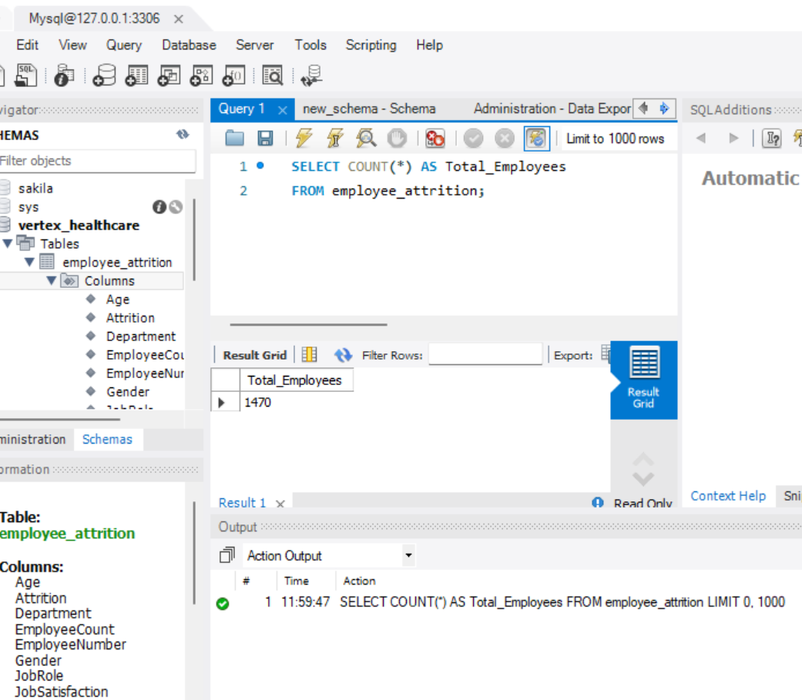
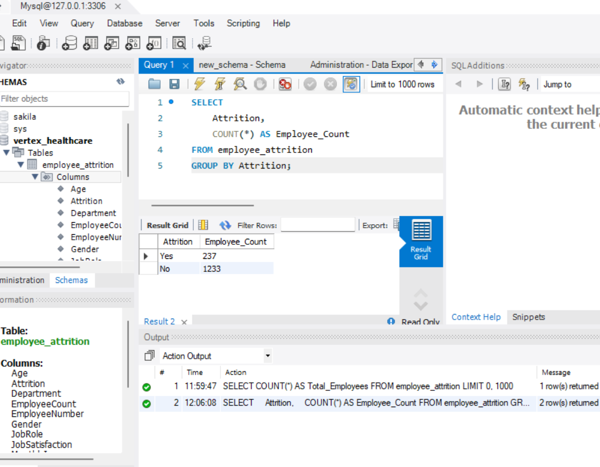
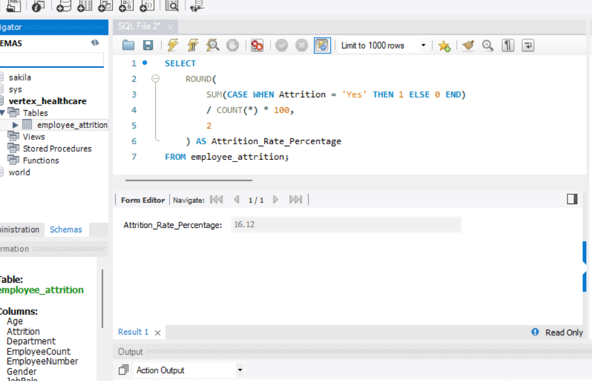
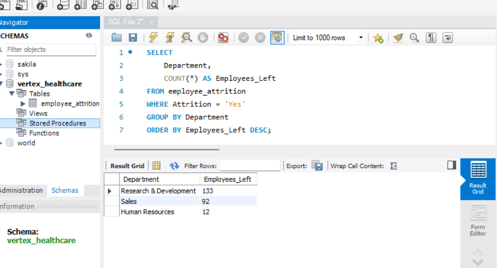
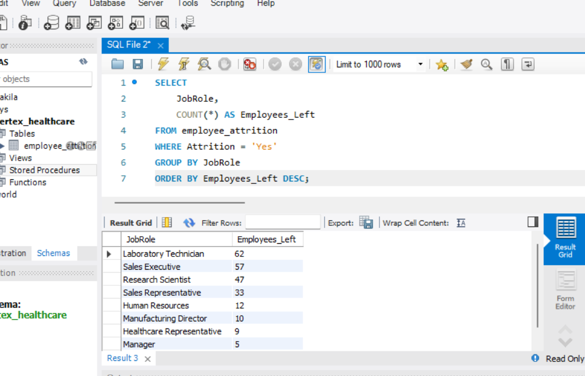
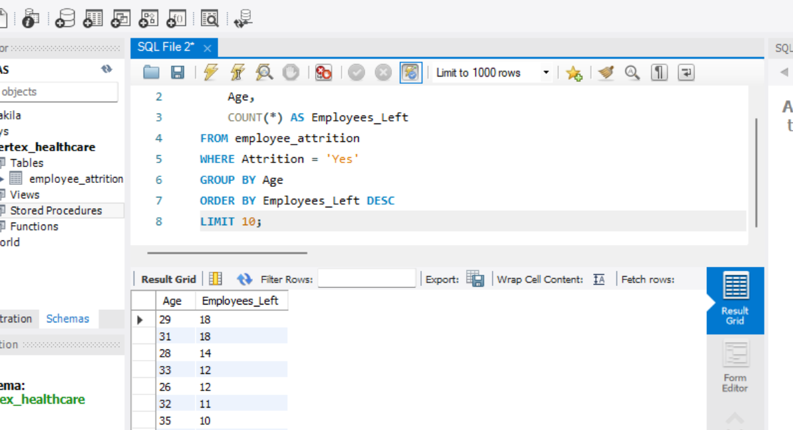
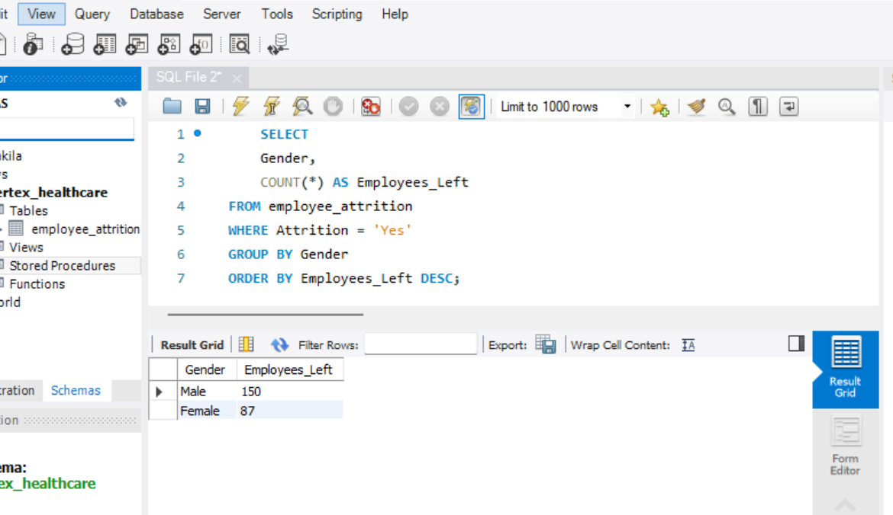

# SQL Analysis
## Overview

This section documents the SQL analysis undertaken to investigate employee attrition at Vertex Healthcare. Each query was designed to answer a specific business question, with the findings later used to support the Excel analysis and Power BI dashboard.

## Section 1: Workforce Overview
### Business Question

How many employees are included in the dataset?

### Business Purpose

Understanding the total workforce provides the foundation for all subsequent analyses. It establishes the population size used to calculate workforce metrics such as the employee attrition rate.

 ### SQL QUERY
 ```
 SELECT COUNT(*) AS Total_Employees
 FROM employee_attrition;
 ```


```
SELECT Attrition,
    COUNT(*) AS Employee_Count
FROM employee_attrition
GROUP BY Attrition;
```


```
SELECT
    ROUND (
        SUM (CASE WHEN Attrition = 'Yes' THEN 1 ELSE 0 END)
        / COUNT(*) * 100,
        2
    ) AS Attrition_Rate_Percentage
FROM employee_attrition;
```


```
SELECT 
    Department,
    COUNT(*) AS Employees_Left
FROM employee_attrition
WHERE Attrition = 'Yes'
GROUP BY Department
ORDER BY Employees_Left DESC;
```


```
SELECT
    JobRole,
    COUNT(*) AS Employees_Left
FROM employee_attrition
WHERE Attrition = 'Yes'
GROUP BY JobRole
ORDER BY Employees_Left DESC;
```


```
SELECT 
    Age,
    COUNT(*) AS Employees_Left
FROM employee_attrition
WHERE Attrition = 'Yes'
GROUP BY Age
ORDER BY Employees_Left DESC
LIMIT 10;
```


```
SELECT 
    Gender,
    COUNT(*) AS Employee_Left
FROM employee_attrition
WHERE Attrition = 'Yes'
GROUP BY Gender
ORDER BY Employee_Left DESC;
```


### Key Findings

The dataset contains 1,470 employee records, representing the total workforce analysed.

## Section 2: Employee Attrition KPI
Business Question

What is the overall employee attrition rate?

### Business Purpose

The employee attrition rate is a key HR performance indicator that measures workforce turnover. It enables management to monitor employee retention and assess whether turnover is increasing or decreasing over time.

### SQL Query
```
SELECT
    Attrition,
    COUNT(*) AS Employee_Count
FROM employee_attrition
GROUP BY Attrition;
```


### Key Finding

Vertex Healthcare Group has:

- 1,470 total employees
- 237 employees who left
- 1,233 employees who stayed

### Attrition  Rate

TBA

## Section 3:Department Analysis
Business Question

*Which departments experience the highest employee attrition?*

TBA

### Business Purpose

Identifying departments with higher employee turnover, enables management to focus retention strategies where they are likely to have the greatest impact.

### SQL Query
```
SELECT
    Department,
    COUNT(*) AS Employees_Left
FROM employee_attrition
WHERE Attrition = 'Yes'
GROUP BY Department
ORDER BY Employees_Left DESC;
```


### Key Finding

The Research & Development department experienced the highest employee attrition, with 133 employees leaving the organization. This was followed by Sales with 92 employees, while Human Resources recorded the lowest number of departures (12 employees).

## Section 4: Job Role Analysis
### Business Question

*Which job roles experience the highest employee attrition?*

### Business Purpose

Understanding turnover by job role helps identify positions that may require improvements in recruitment, career progression, employee engagement, or compensation.

## SQL Query
```
SELECT
    JobRole,
    COUNT(*) AS Employees_Left
FROM employee_attrition
WHERE Attrition = 'Yes'
GROUP BY JobRole
ORDER BY Employees_Left DESC;
```
 

### Key Finding
The Laboratory Technician role experienced the highest employee attrition (62 employees), followed by Sales Executives (57) and Research Scientists (47). These roles should be prioritized for retention strategies, as they account for the largest number of employee departures
(Interpret the findings.)

## Section 5: Age Analysis
### Business Question

*Which age groups experience the highest employee attrition?*

### Business Purpose

Analysing employee turnover by age helps identify demographic trends and supports workforce planning and employee development initiatives.

### SQL Query
```
SELECT
    Age,
    COUNT(*) AS Employees_Left
FROM employee_attrition
WHERE Attrition = 'Yes'
GROUP BY Age
ORDER BY Employees_Left DESC
LIMIT 10;
```


### Key Finding

Employees aged 29 and 31 recorded the highest number of resignations, with 18 employees leaving in each age group. Employees aged 28 followed with 14 departures, while ages 26 and 33 each recorded 12 departures. This suggests that attrition is concentrated among employees in their late 20s and early 30s.


## Section 6: Gender Analysis
### Business Question

*Does employee attrition differ by gender?*

### Business Purpose

Comparing employee turnover by gender helps HR understand workforce trends and determine whether further investigation into retention patterns is required.

### SQL Query
```
SELECT
    Gender,
    COUNT(*) AS Employees_Left
FROM employee_attrition
WHERE Attrition = 'Yes'
GROUP BY Gender
ORDER BY Employees_Left DESC;
```


### Key Finding

Male employees recorded a higher number of resignations (150 employees) compared to female employees (87 employees). This suggests that attrition was more prevalent among male employees in the organization during the period analyzed.

## SQL Analysis Summary

The SQL analysis provided a structured exploration of employee attrition at Vertex Healthcare by calculating key workforce metrics and identifying patterns across departments, job roles, age groups, and gender. These findings formed the analytical foundation for the Excel analysis and the interactive Power BI dashboard, enabling data-driven recommendations to improve employee retentionn.

The analysis revealed that Vertex Healthcare Group experienced an employee attrition rate of 16.12%. The highest employee turnover occurred within the Research & Development department, particularly among Laboratory Technicians, with employees aged 29 to 31 years showing the highest rates of departure. Male employees also recorded more resignations than female employees.

These findings suggest that management should prioritize employee retention initiatives within the Research & Development department and focus on retaining Laboratory Technicians and younger employees through career development opportunities, improved employee engagement, and competitive reward strategies.


## 6. Recommendations
- Develop targeted retention strategies for the Research & Development department.
- Improve career progression opportunities for Laboratory Technicians.
- Introduce mentorship and professional development programmes for employees aged 26–33 years.
- Conduct regular employee satisfaction surveys to identify factors contributing to turnover.
- Review compensation, workload, and work-life balance policies to improve employee retention.
