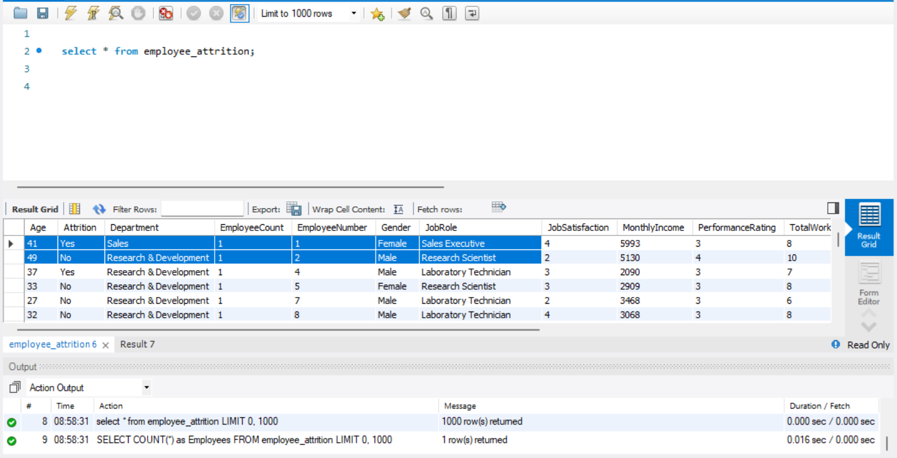

# Employee Attrition Analysis

## Project Overview
Employee attrition is one of the biggest challenges organizations face because it leads to increased recruitment costs, loss of experienced employees, reduced productivity, and disruption of business operations. This project analyzes employee attrition data using SQL to identify the key factors associated with employees leaving the organization. The analysis is intended to provide data-driven insights that can support workforce planning and employee retention strategies.

## Business Problem

Over the past 12 months, Vertex Healthcare has experienced a noticeable increase in employee resignations across several areas of the organisation. Managers have reported growing concerns about vacant positions, increased workloads on remaining staff, and the rising costs associated with recruiting and training new employees.

Although employee turnover has become a recurring challenge, the Human Resources department does not have clear visibility into where employees are leaving, which roles are most affected, or whether certain employee groups are at a greater risk of attrition. As a result, retention initiatives have been implemented broadly rather than being targeted at the areas of greatest need.

To address this issue, the HR Director commissioned a data analysis project to investigate workforce attrition using employee data. The objective is to uncover patterns and trends that will help management understand the workforce better, identify high-risk areas, and make informed decisions that improve employee retention while reducing recruitment costs and operational disruption.

## Business Objectives

The analysis aims to answer the following business questions:

What is the overall employee attrition rate?
Which departments are experiencing the highest employee turnover?
Which job roles contribute most to employee attrition?
Which age groups are most affected by employee turnover?
Are there differences in attrition between male and female employees?

The insights generated from this analysis will support evidence-based decision-making and help Vertex Healthcare develop targeted strategies to improve employee retention and workforce stability.

## Tools Used
- MySQL – Data cleaning and SQL analysis
- Microsoft Excel – Data preparation and validation
- Power BI – Dashboard creation and visualization
- Visual Studio Code – Project documentation and portfolio presentation
- Git & GitHub – Version control and project hosting

## Key Findings

- Overall attrition rate was 16.12%.
- Research & Development recorded the highest number of employees leaving.
- Laboratory Technicians experienced the highest attrition among job roles.
- Employees in their late twenties and early thirties showed the highest number of departures.
- Male employees accounted for a higher number of attrition cases than female employees.

## Recommendations

Based on the findings, the following actions are recommended:

### 1. Prioritise retention within the Research & Development department.

As the department with the highest employee turnover, management should investigate workload, employee engagement, career progression opportunities, and leadership practices to understand the underlying causes of attrition.

### 2. Develop targeted retention strategies for high-risk job roles.

Laboratory Technicians, Sales Executives, and Research Scientists should be prioritised for retention initiatives such as career development programmes, mentoring, recognition schemes, and competitive reward packages.

### 3. Strengthen career development for early and mid-career employees.

The analysis indicates higher attrition among employees in their late twenties and early thirties. Providing structured career pathways, professional development opportunities, and regular performance discussions may improve employee retention.

### 4. Continue monitoring workforce trends.

HR should implement an interactive dashboard to monitor employee attrition over time, enabling management to identify emerging trends and evaluate the effectiveness of retention initiatives.

SQL nippet: 
